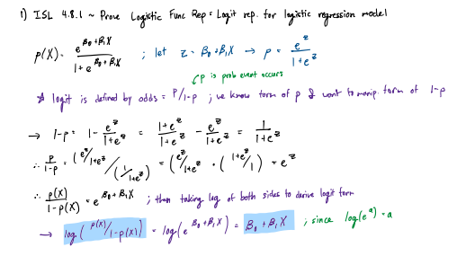
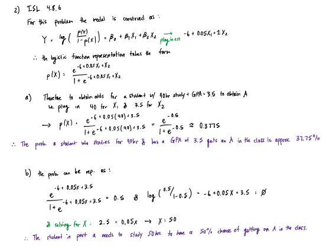
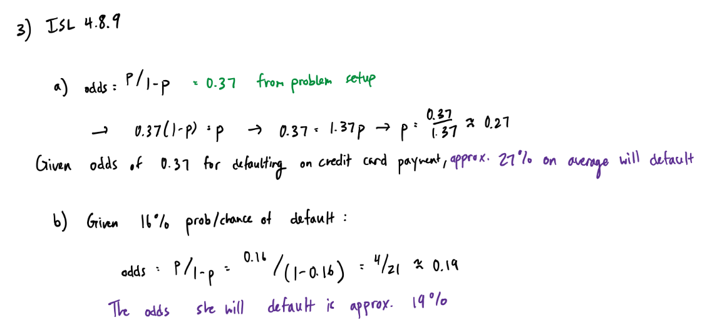
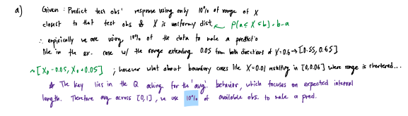
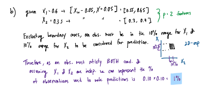
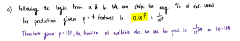
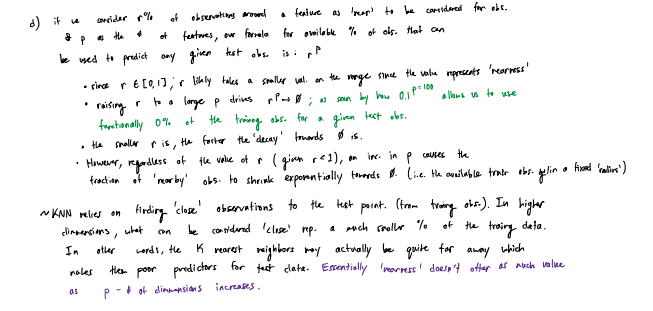
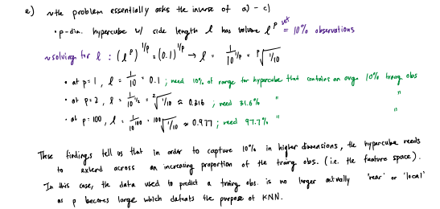

__NOTE__: The Screenshots/ directory contains pdfs of the relevant exercises which might be higher quality than the inserted screenshot images.

## ISL Exercise 4.8.1 (10pts)
Using a little bit of algebra, prove that (4.2) is equivalent to (4.3). In
other words, the logistic function representation and logit represen-
tation for the logistic regression model are equivalent.

**Logistic function (4.2):**
$$p(X) = \frac{e^{\beta_0 + \beta_1 X}}{1 + e^{\beta_0 + \beta_1 X}}$$

**Logit function (4.3):**
$$\frac{p(X)}{1 - p(X)} = e^{\beta_0 + \beta_1 X}$$
$$\log\left(\frac{p(X)}{1 - p(X)}\right) = \beta_0 + \beta_1 X$$



## ISL Exercise 4.8.6 (10pts)

Suppose we collect data for a group of students in a statistics class
with variables X1 = hours studied, X2 = undergrad GPA, and Y =
receive an A. We fit a logistic regression and produce estimated
coefficient, $\hat{\beta}_0 = −6, \hat{\beta}_1 = 0.05, \hat{\beta}_2 = 1$.

(a) Estimate the probability that a student who studies for 40 h and
has an undergrad GPA of 3.5 gets an A in the class.
(b) How many hours would the student in part (a) need to study to
have a 50 % chance of getting an A in the class?



## ISL Exercise 4.8.9 (10pts)

This problem has to do with odds.
(a) On average, what fraction of people with an odds of 0.37 of
defaulting on their credit card payment will in fact default?
(b) Suppose that an individual has a 16 % chance of defaulting on 
her credit card payment. What are the odds that she will de-
fault?



---

## ISL Exercise 4.8.13 (a)-(i) (50pts) [applied question]

This question should be answered using the Weekly data set, which
is part of the ISLR2 package. This data is similar in nature to the
Smarket data from this chapter’s lab, except that it contains 1,089
weekly returns for 21 years, from the beginning of 1990 to the end of
2010.

```{r}
#| label: setup

library(ISLR2)
library(tidyverse)
library(ggplot2)
```

```{r}
# load the data and take a look at the first few rows
ISLR2::Weekly %>% head()
```

### (a) 
Produce some numerical and graphical summaries of the Weekly
data. Do there appear to be any patterns?

```{r}
# numerical summaries
Weekly %>%  summary()
```
```{r}
#| cache: true

# graphical summaries; leave out the Direction variable since it is binary

# pairwise scatterplots of the predictors
pairs(Weekly[, -9], pch = 20, cex.labels = 1.5, font.labels = 2,
      gap = 0.3, oma = c(2, 2, 2, 2),
      labels = colnames(Weekly[, -9]))

# Manual Scatterplot of Lag1 vs Lag2 colored by Direction
Weekly %>%  ggplot(aes(x = Year, y = Volume, color = Direction)) +
  geom_point() +
  labs(title = "Year vs Volume colored by Direction: Identify an Exponential Pattern")
```
```{r}
#| cache: true

# additional manual plots to look at patterns
Weekly %>%  ggplot(aes(x = Year, y = Lag1, color = Direction)) +
  geom_point() +
  labs(title = "Year vs Lag1 colored by Direction")

Weekly %>%  ggplot(aes(x = Lag1, y = Volume, color = Direction)) +
  geom_point() +
  labs(title = "Lag1 vs Volume colored by Direction")
```
```{r}
#| cache: true

library(GGally)
ggpairs(Weekly, columns = 1:8, aes(color = Direction, alpha = 0.5),
        lower = list(continuous = wrap("points", alpha = 0.3, size = 0.5)),
        upper = list(continuous = wrap("cor", size = 3))) # pairwise scatterplots with color by Direction
```

From the Pairwise scatterplots, and manual plotting of interesting patterns (or shapes of the data), we see that there may exist a logistic relationship between Year and Volume. Furthermore, when we use GGally's ggpairs function to look at pairwise scatterplots of the predictors colored by Direction, we see there is a clear (and expected as `Direction` is the sign of `Today`) relationship between the `Today` variable and the `Direction` variable, as the points are clearly separated by color (Direction) along the Today axis.

Additionally, there seems to be little correlation be little correlation between Lag# variables with other Lag# variables and with Year. (spread of points across a roughly horizontal line) For Lag# against Volume, there seems to be little variation in Volume across possible vaalues of Lag#. (the spread of points around a roughly vertical line)

### (b) 
Use the full data set to perform a logistic regression with
Direction as the response and the five lag variables plus Volume
as predictors. Use the summary function to print the results. Do
any of the predictors appear to be statistically significant? If so,
which ones?

```{r}
#| eval: true

# fitting logistic regression model with Direction as response and Lag1, Lag2, Lag3, Lag4, Lag5, Volume as predictors
logistic_model <- glm(Direction ~ Lag1 + Lag2 + Lag3 + Lag4 + Lag5 + Volume, data = Weekly, family = binomial)
summary(logistic_model)
```

The predictor that appears to be statistically significant in the logistic regression model with `Direction` as the response and the five lag variables plus `Volume` as predictors is `Lag2` at the 0.05 significance level (p-value = 0.0296). 

NOTE: if we also include `Today` as a predictor, then `Today` is also statistically significant at the 0.05 significance level.


### (c) 
Compute the confusion matrix and overall fraction of correct
predictions. Explain what the confusion matrix is telling you
about the types of mistakes made by logistic regression.

https://www.digitalocean.com/community/tutorials/confusion-matrix-in-r

```{r}
library(caret)

# predict the probabilities of the positive class (Up) using the logistic regression model
probs <- predict(logistic_model, type = "response")

# convert probabilities to factor class labels using 0.5 threshold
# 0.5 is a loigical decision boundary: if P > 0.5, classify as "Up", else "Down"
predicted_direction <- factor(ifelse(probs > 0.5, "Up", "Down"),
                              levels = levels(Weekly$Direction))

# the data must be treated this way, since the confusionMatrix function expects factor variables with the same levels for both data and reference
confusion_matrix <- confusionMatrix(data = predicted_direction,
                                    reference = Weekly$Direction,
                                    positive = "Up")
confusion_matrix

# Extracting specifically the accuracy of the model (overall fraction of correct predictions)
model_accuracy <- confusion_matrix$overall['Accuracy']
model_accuracy
```

Note that execution of the confusion_matrix object prints out both the confusion matrix table and relevant statistics such as accuracy, sensitivity, and specificity. We can also calculate other statuistics:

If we consider the "Up" class as the positive class, then we can calculate the following statistics Manually:

* TPR (Sensitivity) = TP / (TP + FN) = 557 / (557 + 48) = 0.921
* TNR (Specificity) = TN / (TN + FP) = 54 / (54 + 430) = 0.112
* FPR = FP / (FP + TN) = 430 / (430 + 54) = 0.888
* FNR = FN / (TP + FN) = 48 / (557 + 48) = 0.079
* Positive Predictive Value (PPV) = TP / (TP + FP) = 557 / (557 + 430) = 0.564
* Negative Predictive Value (NPV) = TN / (TN + FN) = 54 / (54 + 48) = 0.529

These values tell us that the logistic regression model is very good at correctly identifying "Up" weeks (high sensitivity), but it is not good at correctly identifying "Down" weeks (low specificity). The model has a high false positive rate, meaning that it often incorrectly predicts "Up" when the actual outcome is "Down". Inversly, low false negative rate indicates that the model is good at correctly identifying "Up" weeks, but the high false positive rate indicates that it struggles to correctly identify "Down" weeks.

The positive predictive value (accuracy/precision) indicates that when the model predicts "Up", it is correct about 56.4% of the time, while the negative predictive value indicates that when the model predicts "Down", it is correct about 52.9% of the time.

This reflects the fact that the model has a bias towards predicting "Up" weeks, which may be due to the imbalance in the dataset (more "Up" weeks than "Down" weeks) or due to the nature of the predictors used in the logistic model.

### (d) 
Now fit the logistic regression model using a training data period
from 1990 to 2008, with Lag2 as the only predictor. Compute the
confusion matrix and the overall fraction of correct predictions
for the held out data (that is, the data from 2009 and 2010).

* Lag2 as the only predictor
* training data period from 1990 to 2008
* held out data from 2009 and 2010

```{r}
# filter dplyr does not require sorting but, it makes it easier to visualize
Weekly_sorted <- Weekly %>% arrange(Year)

# split data by specified criteria for training and testing
train_data <- Weekly_sorted %>% filter(Year >= 1990 & Year <= 2008)
test_data <- Weekly_sorted %>% filter(Year >= 2009 & Year <= 2010)
```
```{r}
# fit logistic model w/ Lag2 as the only predictor on the training data
logistic_model_lag2 <- glm(Direction ~ Lag2, data = train_data, family = binomial)
summary(logistic_model_lag2)
```
```{r}
# predict probabilities on the test data using the fitted model

# use type = "response" since we want to set the probability-related threshold for classification (0.5) and not the log-odds threshold (0)
probs_test <- predict(logistic_model_lag2, newdata = test_data, type = "response")
predicted_direction_test <- factor(ifelse(probs_test > 0.5, "Up", "Down"),
                                   levels = levels(test_data$Direction))
confusion_matrix_test <- confusionMatrix(data = predicted_direction_test,
                                         reference = test_data$Direction,
                                         positive = "Up")
confusion_matrix_test
```

The overall fraction of correct predictions for the held out data which can be represented as [TP+TN] / [TP + TN + FP + FN] or model accuracy is 0.625, which is the accuracy of the model using the training data (1990-2008) to predict the test data (2009-2010) using Lag2 as the only predictor.

### (e) Repeat (d) using LDA.
```{r}
# load in the MASS package for LDA
library(MASS)
```

```{r}
# fit LDA model w/ Lag2 as the only predictor on the training data
lda_lag2 <- lda(Direction ~ Lag2, data = train_data)
lda_lag2
```
```{r}
# predict on the test data using the fitted LDA model

# whearas predict.glm returns a numeric vector of probabilities, predict.lda returns a factor variable with predicted class labels and posterior probabilities for each class
lda_predictions <- predict(lda_lag2, newdata = test_data)
predicted_direction_lda <- lda_predictions$class
confusion_matrix_lda <- confusionMatrix(data = predicted_direction_lda,
                                       reference = test_data$Direction,
                                       positive = "Up")
confusion_matrix_lda
```

The overall fraction of correct predictions for the held out data using LDA with Lag2 as the only predictor is 0.625, which is the same as the accuracy obtained from logistic regression in part (d). Moreover, the TP, TN, FP, and FN values are also the same for both models, indicating that both logistic regression and LDA made the same predictions on the test data when using Lag2 as the only predictor.

### (f) Repeat (d) using QDA.

QDA is also available in the MASS package, and has a similar workflow to LDA.
```{r}
# fit QDA model w/ Lag2 as the only predictor on the training data
qda_lag2 <- qda(Direction ~ Lag2, data = train_data)
qda_lag2
```
```{r}
# predict on the test data using the fitted QDA model
qda_predictions <- predict(qda_lag2, newdata = test_data)
predicted_direction_qda <- qda_predictions$class
confusion_matrix_qda <- confusionMatrix(data = predicted_direction_qda,
                                       reference = test_data$Direction,
                                       positive = "Up")
confusion_matrix_qda
```

The overall fraction of correct predictions for the held out data using QDA with Lag2 as the only predictor is approximately 0.587, which is lower than the accuracy obtained from logistic regression and LDA in part (d) and (e). In actuality, the QDA model performs much worse as it predicts "Up" for all test observations, which means although it correctly identifies all "Up" weeks (TP = 61), it fails to identify any "Down" weeks (TN = 0), resulting in a high number of false positives (FP = 43) and no true negatives (TN = 0). This leads to a lower overall accuracy compared to the logistic regression and LDA models.

### (g) Repeat (d) using KNN with K = 1.

Utilize `class` package for simple KNN. (could also use `caret`)

```{r}
library(class)

# knn expects the training and test data to be in matrix or data frame format, and the class labels to be a factor variable.
knn_predictions <- knn(train = data.frame(train_data$Lag2),
                       test = data.frame(test_data$Lag2),
                       cl = train_data$Direction, k = 1)
confusion_matrix_knn <- confusionMatrix(data = knn_predictions,
                                       reference = test_data$Direction,
                                       positive = "Up")
confusion_matrix_knn
```

The overall fraction of correct predictions for the held out data using KNN with K = 1 and Lag2 as the onle predictor is approximately 0.51. The KNN model performs the worst among the models, with higher specificity than LDA/logistic regression but much lower sensitivity, as the model at K = 1 is very sensitive to noise. As such the model generates a large number of false negatives and false positives. 

### (h) Repeat (d) using naive Bayes.

```{r}
# load in the e1071 package for naive Bayes
library(e1071)
```

```{r}
# fit naive Bayes model w/ Lag2 as the only predictor on the training data
naive_bayes_lag2 <- naiveBayes(Direction ~ Lag2, data = train_data)
naive_bayes_lag2
```
```{r}
# predict on the test data using the fitted naive Bayes model
# predict.naiveBayes returns also returns a factor variable with predicted class labels and posterior probabilities for each class
naive_bayes_predictions <- predict(naive_bayes_lag2, newdata = test_data)
confusion_matrix_nb <- confusionMatrix(data = naive_bayes_predictions,
                                      reference = test_data$Direction,
                                      positive = "Up")
confusion_matrix_nb
```

Naive Bayes with Lag2 as the only predictor performs identically to QDA, with an accuracy of approximately 0.587. Both models predict "Up" for all test observations, resulting in TP = 61, TN = 0, FP = 43, and FN = 0. This indicates that the Naive Bayes model, like QDA, is unable to correctly identify any "Down" weeks in the test data.

Conducting research to understand why this happens, it turns out QDA with a single continuous predictor fits a seperate means and variance for each class which is equivalent to QDA does with a single continuous predictor.

### (i) 
Which of these methods appears to provide the best results on
this data?

The method that appears to provide the best results on this data is Logistic Regression and LDA (both performing identically in this case) with an accuracy of approximately 0.625. Both Logistic Regression and LDA correctly identify a higher number of "Up" weeks (TP = 61) while also correctly identifying some "Down" weeks (TN = 12), leading to a better balance between sensitivity and specificity compared to the other models. QDA and Naive Bayes failed to identify any "Down" weeks, resulting in a lower overall accuracy, while KNN with K = 1 pis a bad choice for this data due to it creating a decision boundary that is too flexible, leading to overfitting and poor generalization to the test data.

## Bonus question: ISL Exercise 4.8.13 Part (j) (30pts)

(j) Experiment with different combinations of predictors, including possible transformations and interactions, for each of the methods. Report the variables, method, and associated confusion matrix that appears to provide the best results on the held out data. Note that you should also experiment with values for K in the KNN classifier.

## Bonus question: ISL Exercise 4.8.4 (30pts)

When the number of features p is large, there tends to be a deterioration in the performance of KNN and other local approaches that perform prediction using only observations that are near the test observation for which a prediction must be made. 

This phenomenon isknown as the curse of dimensionality, and it ties into the fact that non-parametric approaches often perform poorly when p is large. We will now investigate this curse.

(a) Suppose that we have a set of observations, each with measure-
ments on p = 1 feature, X. We assume that X is uniformly (evenly) distributed on [0, 1]. Associated with each observation is a response value. Suppose that we wish to predict a test observation’s response using only observations that are within 10 % of the range of X closest to that test observation. For instance, in order to predict the response for a test observation with X = 0.6,
we will use observations in the range [0.55, 0.65]. On average,
what fraction of the available observations will we use to make
the prediction?



(b) Now suppose that we have a set of observations, each with
measurements on p = 2 features, X1 and X2. We assume that
(X1, X2) are uniformly distributed on [0, 1] × [0, 1]. We wish to
predict a test observation’s response using only observations that
are within 10 % of the range of X1 and within 10 % of the range
of X2 closest to that test observation. For instance, in order to
predict the response for a test observation with X1 = 0.6 and
X2 = 0.35, we will use observations in the range [0.55, 0.65] for
X1 and in the range [0.3, 0.4] for X2. On average, what fraction
of the available observations will we use to make the prediction?



(c) Now suppose that we have a set of observations on p = 100 features. Again the observations are uniformly distributed on each feature, and again each feature ranges in value from 0 to 1. We wish to predict a test observation’s response using observations within the 10 % of each feature’s range that is closest to that test observation. What fraction of the available observations will we use to make the prediction?



(d) Using your answers to parts (a)–(c), argue that a drawback of KNN when p is large is that there are very few training observations “near” any given test observation.



(e) Now suppose that we wish to make a prediction for a test observation by creating a p-dimensional hypercube centered around the test observation that contains, on average, 10 % of the training observations. For p = 1, 2, and 100, what is the length of each side of the hypercube? Comment on your answer.

Note: A hypercube is a generalization of a cube to an arbitrary
number of dimensions. When p = 1, a hypercube is simply a line
segment, when p = 2 it is a square, and when p = 100 it is a
100-dimensional cube. 

