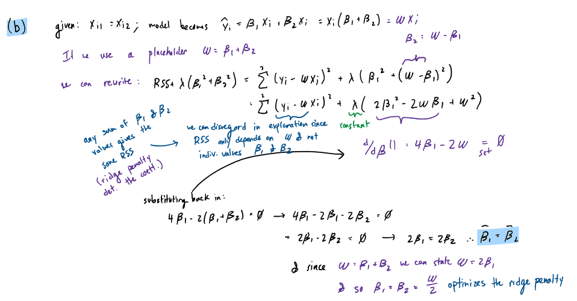
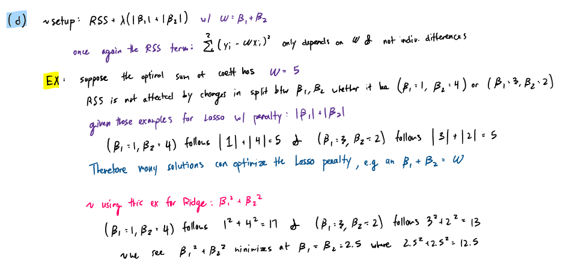

__NOTE__: In the Screenshots folder there may exist higher quality PDFs of handwritten work for exercises 3 and 7.

## ISL Exercise 5.4.2 (10pts)

We will now derive the probability that a given observation is part
of a bootstrap sample. Suppose that we obtain a bootstrap sample
from a set of n observations.

(a) What is the probability that the first bootstrap observation is
not the jth observation from the original sample? Justify your
answer.

Given n observations, the probability that the first bootstrap observation is not the jth observation from the original sample is:
$$P(\text{not jth observation}) = 1 - P(\text{jth observation}) = 1 - \frac{1}{n} = \frac{n-1}{n}$$

This is because each observation has an equal chance of being selected in the bootstrap sample, and there are n observations in total (total sample size). Therefore, the probability of selecting the jth observation is $\frac{1}{n}$, and the probability of not selecting it is $1 - \frac{1}{n}$.

(b) What is the probability that the second bootstrap observation
is not the jth observation from the original sample?

Bootstrap sampling is done with replacement, so the probability that the second bootstrap observation is not the jth observation(index) has the same odds of $\frac{n-1}{n}$. (essentially draws are independent)

(c) Argue that the probability that the jth observation is not in the
bootstrap sample is $(1 − 1/n)^n$.

Given that the bootstrap observations are independent, the probability jth observation is not in any of n draws sample is (probability of being selected for jth observation, in which the value is equivalent for every j) raised to the power of n. That is equivalent to $(1 - \frac{1}{n})^n$ or $(1 - 1/n)^n$.

Note that n controls both the number of draws and the probability of being selected for each draw (since each observation has a $\frac{1}{n}$ chance of being selected).

(d) When n = 5, what is the probability that the jth observation is
in the bootstrap sample?

The probability that the jth observation is in the bootstrap sample is the complement of the probability that it is not in the bootstrap sample. Therefore, when n = 5, the probability that the jth observation is in the bootstrap sample is:
  
$P(\text{jth observation in bootstrap sample}) = 1 - P(\text{jth observation not in bootstrap sample})$

$= 1 - (1 - \frac{1}{5})^5 = 1 - (1 - 0.2)^5 = 1 - (0.8)^5 = 1 - 0.32768 = 0.67232$

So, the probability that the jth observation is in the bootstrap sample when n = 5 is approximately 0.67232 or 67.232%.

(e) When n = 100, what is the probability that the jth observation
is in the bootstrap sample?

$1 - (1 - \frac{1}{100})^{100} = 1 - (0.99)^{100} \approx 1 - 0.36603 = 0.63397$

Similarly, when n = 100 the probability that the jth observation is in the bootstrap sample is approximately 0.63397 or 63.397%.

(f) When n = 10,000, what is the probability that the jth observa-
tion is in the bootstrap sample?
$1 - (1 - \frac{1}{10000})^{10000} = 1 - (0.9999)^{10000} \approx 1 - 0.36788 = 0.63212$

So, the probability that the jth observation is in the bootstrap sample when n = 10,000 is approximately 0.63212 or 63.212%.

(g) Create a plot that displays, for each integer value of n from 1
to 100, 000, the probability that the jth observation is in the
bootstrap sample. Comment on what you observe.

```{r}
library(ggplot2)

n_values <- 1:100000
probabilities <- 1 - (1 - 1/n_values)^n_values

n_against_prob <- data.frame(n = n_values, probability = probabilities)

ggplot(n_against_prob, aes(x = n, y = probability)) +
  geom_point(alpha = 0.5) +
  labs(title = "Probability that the jth observation is in the nth bootstrap sample",
       x = "n (number of observations)",
       y = "Probability") +
  scale_y_continuous(labels = scales::percent_format(accuracy = 1), limits = c(0, 1)) +
  theme_minimal()
```

We identify that the probability that the jth observation is in the bootstrap sample $P(\text{jth observation in bootstrap sample}) = 1 - (1 - \frac{1}{n})^n$ approaches a limit as n increases. 

As n approaches infinity, the expression $1 - (1 - \frac{1}{n})^n$ approaches $1 - \frac{1}{e}$, which is approximately 0.63212. Therefore, the probability that the jth observation is in the bootstrap sample approaches approximately 63.212% as n becomes large. In other words given a significant number of observations, about 63.2% of the original observations are included in each bootstrap sample, while the remaining 36.8% are not included.

(h) We will now investigate numerically the probability that a boot-
strap sample of size n = 100 contains the jth observation. Here
j = 4. We repeatedly create bootstrap samples, and each time
we record whether or not the fourth observation is contained in
the bootstrap sample.

```{r}
set.seed(123) # for reproducibility

store <- rep(NA, 1000)
for (i in 1:1000) { # 1000 repetitions of the bootstrap sampling process
  store[i] <- sum(sample(1:100, replace = TRUE) == 4) > 0
}
mean(store)
```

The estimated average probability that the 4th observation (index j = 4) given a bootstrap sample of size n = 100, set.seed(123) and 1000 repetitions is approximately 0.65. This value seems reasonably consistent with the theoretical probability $1 - (1 - \frac{1}{100})^{100} \approx 0.63397 \approx 0.63212$ that we calculated in part (e). The slight difference can be attributed to the randomness of the sampling process and the finite number of repetitions (1000) used in the simulation.


## ISL Exercise 5.4.9 (20pts)

We will now consider the Boston housing data set, from the ISLR2
library.

(a) Based on this data set, provide an estimate for the population
mean of medv. Call this estimate µ̂.

https://rdrr.io/cran/ISLR2/man/Boston.html
```{r}
library(ISLR2)
data(Boston)
head(Boston)
```
```{r}
# since Boston dataset is a sample of the population, we can use the sample mean as an estimate for the population mean of medv

mu_hat <- mean(Boston$medv, na.rm = TRUE)
mu_hat
```

(b) Provide an estimate of the standard error of µ̂. Interpret this
result.
Hint: We can compute the standard error of the sample mean by
dividing the sample standard deviation by the square root of the
number of observations.

```{r}
# calculations are done on non-missing values
num_obs <- sum(!is.na(Boston$medv))
se_mu_hat <- sd(Boston$medv, na.rm = TRUE) / sqrt(num_obs)
se_mu_hat
```

(c) Now estimate the standard error of µ̂ using the bootstrap. How
does this compare to your answer from (b)?

```{r}
library(boot)
set.seed(123) # for reproducibility

# workflow, creation of helper function
mean.fn <- function(data, index) {
  return(mean(data$medv[index], na.rm = TRUE))
}

bootoutput <- boot(Boston, statistic = mean.fn, R = 1000)

# extract the se object
se_bootstrap <- sd(bootoutput$t)
se_bootstrap
```

From the results of the bootstrap, we obtain an estimate of the standard error of µ̂ (the mean of medv) of approximately 0.40456. This estimate is reasonably close to the standard error calculated in part (b) of 0.40886, which suggests that the bootstrap method provides a similar estimate of the standard error as the traditional formula for calculating standard error.

(d) Based on your bootstrap estimate from (c), provide a 95 % confidence interval for the mean of medv. Compare it to the results obtained using t.test(Boston$medv).
Hint: You can approximate a 95 % confidence interval using the
formula $[µ̂ − 2SE(µ̂), µ̂ + 2SE(µ̂)]$.

```{r}
# we can use the boot package
boot.ci <- boot.ci(bootoutput, type = "norm")
# we can also calculate manually

ci_lower <- mu_hat - 2 * se_bootstrap
ci_upper <- mu_hat + 2 * se_bootstrap

paste0("Bootstrap 95% CI: [", round(ci_lower, 4), ", ", round(ci_upper, 4), "]")

# using t.test
t_test_result <- t.test(Boston$medv, conf.level = 0.95)
```

The approximate 95% CI of the mean of medv using bootstrap is [21.7237, 23.3419] whilst the 95% CU using t.test is [21.72953 23.33608]. The two CI intervals are quite similar, which suggests that the bootstrap method provides a comparable estimate of the confidence interval for the mean of medv as the traditional t-test method for this scenario.

(e) Based on this data set, provide an estimate, µ̂med, for the median value of medv in the population.

```{r}
mu_hat_med <- median(Boston$medv, na.rm = TRUE)
mu_hat_med
```

(f) We now would like to estimate the standard error of $µ̂_{med}$ . Unfortunately, there is no simple formula for computing the standard error of the median. Instead, estimate the standard error of the median using the bootstrap. Comment on your findings.

```{r}
median.fn <- function(data, index) {
  return(median(data$medv[index], na.rm = TRUE))
}
bootoutput_median <- boot(Boston, statistic = median.fn, R = 1000)
se_bootstrap_median <- sd(bootoutput_median$t)
se_bootstrap_median
```

The standard of the median using bootstrap is approximately 0.3784. This value, being slightly smaller than the calculated standard error of the mean suggests that the median may be a more precise estimate of the true central tendency of the medv variable relative to the mean. This may suggest the existence of outliers in the medv variable.

(g) Based on this data set, provide an estimate for the tenth percentile of medv in Boston census tracts. Call this quantity $µ̂_{0.1}$. (You can use the quantile() function.)

https://www.rdocumentation.org/packages/stats/versions/3.6.2/topics/quantile

```{r}
# probs argument in quantile() allows specification of percentile

mu_hat_0.1 <- quantile(Boston$medv, probs = 0.1, na.rm = TRUE)
mu_hat_0.1
```

(h) Use the bootstrap to estimate the standard error of $µ̂_{0.1}$ . Comment on your findings.

```{r}
quantile.fn <- function(data, index) {
  return(quantile(data$medv[index], probs = 0.1, na.rm = TRUE))
}
bootoutput_quantile <- boot(Boston, statistic = quantile.fn, R = 1000)
se_bootstrap_quantile <- sd(bootoutput_quantile$t)
se_bootstrap_quantile
```

The SE of the 10th percentile for medv using bootstrap is approximately 0.5083. This suggests that there is a relatively higher amount of variability in the estimate of the 10th percentile of medv across different bootstrap samples compared to the mean and median estimates. 

## Least squares is MLE (10pts)

Show that in the case of linear model with Gaussian errors, maximum likelihood and least squares are the same thing, and $C_p$ and AIC are equivalent.

MLE for linear regression is an unbiased estimator of the coefficients, and it can be shown that the MLE estimates for the coefficients in a linear regression model with Gaussian errors are the same as the least squares estimates:


## ISL Exercise 6.6.1 (10pts)

We perform best subset, forward stepwise, and backward stepwise
selection on a single data set. For each approach, we obtain p + 1
models, containing 0, 1, 2, . . . , p predictors. Explain your answers:

* "Forward stepwise selection begins with a model containing no predictors, and then adds predictors to the model, one-at-a-time, until all of the predictors are in the model."
* backwards stepwise selection begins with a model containing all predictors, and then removes predictors from the model, one-at-a-time, until there is only one predictor left in the model.(Mk is the model with k predictors; we choose the predictor that gives the lowest RSS at each step)
* Best subset selection fits a separate regression model for each possible combination of the p predictors, and then selects the best model among all of the models that have been fit. (fit all ${p \choose k}$ models)

(a) Which of the three models with k predictors has the smallest
training RSS?

Given k predictors, best subset selection will have the smallest training RSS, since it fits all possible ${p \choose k}$ models to find the one with the lowest training RSS. Forward stepwise selection and backward stepwise selection may find the model with the lowest training RSS among the models they consider, but they do not guarantee that they will find the model with the lowest training RSS among all possible models with k predictors.

(b) Which of the three models with k predictors has the smallest
test RSS?

Training RSS is not a good indicator of test RSS, due to overfitting. Until the model with k predictors is actually evaluated on the test set, we __cannot determine__ which model actually has the smallest test RSS. (best subset selection may overfit the training data, leading to higher test RSS, but may also find a model that generalizes well to test data).

(c) True or False:
  i. The predictors in the k-variable model identified by forward
  stepwise are a subset of the predictors in the (k +1)-variable
  model identified by forward stepwise selection.

__True__ $M_k$ is a subset of $M_{k+1}$ for forward stepwise selection, since forward stepwise selection adds predictors one at a time (never removing predictors), so the model with k predictors will always be a subset of the model with k + 1 predictors.

  ii. The predictors in the k-variable model identified by back-
  ward stepwise are a subset of the predictors in the (k + 1)-
  variable model identified by backward stepwise selection.

__True__, a backwards stepwise selection Model with k predictors logically comes from a model with k + 1 predictors by removing one predictor, so the model with k predictors will always be a subset of the model with k + 1 predictors in backward stepwise selection.

  iii. The predictors in the k-variable model identified by back-
  ward stepwise are a subset of the predictors in the (k + 1)-
  variable model identified by forward stepwise selection.

__False__. (example predictors: a,b,c,d). Forward model of k = 2 (k + 1 = 3) may select a,b and c, while backward k-variable model of k = 2 may select c and d.
Essentially there is no gaurantee that the predictors overlap.

  iv. The predictors in the k-variable model identified by forward
  stepwise are a subset of the predictors in the (k +1)-variable
  model identified by backward stepwise selection.

__False__ for similar reasons as (iii).

  v. The predictors in the k-variable model identified by best
  subset are a subset of the predictors in the (k + 1)-variable
  model identified by best subset selection.

__False__. Best subset selection is not sequential and chooses predictors independently for each size of k.


## ISL Exercise 6.6.3 (10pts)

Suppose we estimate the regression coefficients in a linear regression
model by minimizing

$$
\sum_{i=1}^{n} \left( y_i - \beta_0 - \sum_{j=1}^{p} \beta_j x_{ij} \right)^2 \quad \text{subject to} \quad \sum_{j=1}^{p} |\beta_j| \leq s
$$

* constrained form of the LASSO (L1‑penalized) linear regression:
* wheras the penalty form controls flexibility of the model by adding a penalty term to the RSS, the constrained form controls flexibility directly by imposing a constraint on the sum of the absolute values of the coefficients.
* we are minimizing RSS subject to a constraint on the sum of the absolute values of the coefficients
* when s = 0, all coefficients are zero; $\beta_1 = \beta_2 = \ldots = \beta_p = 0$. Model is just the intercept: $y_i = \beta_0$
* Therefore, as s increases, the model becomes more flexible.

for a particular value of s. For parts (a) through (e), indicate which
of i. through v. is correct. Justify your answer.

i. Increase initially, and then eventually start decreasing in an
inverted U shape.
ii. Decrease initially, and then eventually start increasing in a
U shape.
iii. Steadily increase.
iv. Steadily decrease.
v. Remain constant.


(a) As we increase s from 0, the training RSS will:

__iv. Steadily decrease__. As s increases, the constraint on the coefficients becomes less strict, allowing for more flexibility in the model and the coefficient can grow to fit the data better, which will lead to a decrease in training RSS. 

(b) Repeat (a) for test RSS.
  * with parameter s we are moving from low flexibility to high flexibility
  * underfit → optimal → overfit

__ii. Decrease initially, and then eventually start increasing in a U shape.__ This is an example of bias-variance tradeoff. (general shape of plotting the coefficient against the RSS) Initially, as s increases the model will improve since it starts off underfit, but as s increases further, the model may become too flexible and overfit to training data.

(c) Repeat (a) for variance.

__iii. Steadily increase__. As s increases, the model becomes more flexible and can fit the training data better, which leads to an increase in variance. (very flexible models have high variance)

(d) Repeat (a) for (squared) bias.

__iv. Steadily decrease__. Inverse relationship as variance. Flexible models are closer to the `true` model, so bias decreases as s increases.

(e) Repeat (a) for the irreducible error.

__v. Remain constant__. As irreducible error is of the data and is independent of the model/estimator, it remains constant regardles of s.


## ISL Exercise 6.6.4 (10pts)
Suppose we estimate the regression coefficients in a linear regression
model by minimizing
$$
\sum_{i=1}^{n} \left( y_i - \beta_0 - \sum_{j=1}^{p} \beta_j x_{ij} \right)^2 + \lambda \sum_{j=1}^{p} \beta_j^2
$$

* Ridge regression (L2 penalized) Penalty Form
* λ controls flexibility
* Increasing λ → increases penalty → shrinks coefficients → less flexible
* relationship between λ and the training RSS parameter is opposite to the relationship between s and training RSS. As λ increases, the model becomes less flexible.

for a particular value of λ. For parts (a) through (e), indicate which
of i. through v. is correct. Justify your answer.

i. Increase initially, and then eventually start decreasing in an
inverted U shape.
ii. Decrease initially, and then eventually start increasing in a
U shape.
iii. Steadily increase.
iv. Steadily decrease.
v. Remain constant.

(a) As we increase λ from 0, the training RSS will:

__iii. Steadily increase__. As λ increases, the penalty on the coefficients becomes stronger, which leads to smaller coefficients and a less flexible model. This generally results in a worse fit to the training data, leading to an increase in training RSS. 

(b) Repeat (a) for test RSS.
  * with parameter λ we are moving from high flexibility to low flexibility
  * overfit → optimal → underfit

__ii. Decrease initially, and then eventually start increasing in a U shape.__ Test RSS vs flexibility always has a U shape due to bias-variance tradeoff. 
At λ = 0 (OLS), the model may be overfitting to the training data leading to high test RSS. As λ increases, the model becomes less flexible and may generalize better to the test data, leading to a decrease in test RSS. However, if λ becomes too large, the model may become too rigid and underfit the data, leading to an increase in test RSS.

(c) Repeat (a) for variance.

__iv. Steadily decrease__. As λ increases, the model becomes less flexible and more constrained, which leads to a decrease in variance. Ridge regression shrinks coefficients towards zero, which can help reduce variance.

(d) Repeat (a) for (squared) bias.

__iii. Steadily increase__. As λ increases, the model becomes less flexible and more constrained, which leads to an increase in bias. (rigid models are further from the `true` model, so bias increases as λ increases)

(e) Repeat (a) for the irreducible error.

__v. Remain constant__. As irreducible error is of the data and is independent of the model/estimator, it remains constant regardless of λ.


## ISL Exercise 6.6.5 (10pts)

It is well-known that ridge regression tends to give similar coefficient
values to correlated variables, whereas the lasso may give quite different coefficient values to correlated variables. We will now explore
this property in a very simple setting.
Suppose that $n = 2$, $p = 2$, $x_{11} = x_{12}$, $x_{21} = x_{22}$. Furthermore,
suppose that $y_1 + y_2 = 0$ and $x_{11} + x_{21} = 0$ and $x_{12} + x_{22} = 0$, so that
the estimate for the intercept in a least squares, ridge regression, or
lasso model is zero: $\hat{\beta}_0 = 0$.

* 2 observation, 2 predictors
* predictors are perfectly correlated / identical (e.g. $x_{11} = x_{12}$)
* sum of responses is zero and sum of predictors is zero
  * consequently, the intercept is zero

(a) Write out the ridge regression optimization problem in this setting.

* Ridge regression optimization problem's goal is to minimzie the RSS + penalty
$$
\hat{\beta}_{Ridge} =
\min_{\beta_1, \beta_2} \left[ \sum_{i=1}^{2} \left( y_i - \beta_1 x_{i1} - \beta_2 x_{i2} \right)^2 + \lambda_{Ridge} (\beta_1^2 + \beta_2^2) \right]
$$

(b) Argue that in this setting, the ridge coefficient estimates satisfy
$\hat{\beta}_1 = \hat{\beta}_2$.

In this setting, since $x_{11} = x_{12}$ and $x_{21} = x_{22}$, and given that the sum of responses and predictors are zero, the optimization problem is symmetric in $\beta_1$ and $\beta_2$. This symmetry implies that the optimal solution must have $\hat{\beta}_1 = \hat{\beta}_2$.



Essentially, in this scenario, ridge penalty selects the minimum of RSS + penalty which occurs at the point where $\beta_1$ and $\beta_2$ are equal.

(c) Write out the lasso optimization problem in this setting.

$$
\hat{\beta}_{Lasso} =
\min_{\beta_1, \beta_2} \left[ \sum_{i=1}^{2} \left( y_i - \beta_1 x_{i1} - \beta_2 x_{i2} \right)^2 + \lambda_{Lasso} (|\beta_1| + |\beta_2|) \right]
$$

(d) Argue that in this setting, the lasso coefficients $\hat{\beta}_1$ and $\hat{\beta}_2$ are not unique. In other words, there are many possible solutions to the optimization problem in (c). Describe these solutions.



## ISL Exercise 6.6.11 (30pts)

We will now try to predict per capita crime rate in the Boston data
set.

(a) Try out some of the regression methods explored in this chapter,
such as best subset selection, the lasso, ridge regression, and
PCR. Present and discuss results for the approaches that you
consider.
(b) Propose a model (or set of models) that seem to perform well on
this data set, and justify your answer. Make sure that you are
evaluating model performance using validation set error, cross-
validation, or some other reasonable alternative, as opposed to
using training error.
(c) Does your chosen model involve all of the features in the data
set? Why or why not?

You must follow the [typical machine learning paradigm](https://ucla-biostat-212a.github.io/2026winter/slides/06-modelselection/workflow_lasso.html) to compare _at least_ 3 methods: least squares, lasso, and ridge. Report final results as

| Method | CV RMSE | Test RMSE |
|:------:|:------:|:------:|:------:|
| LS | | | |
| Ridge | | | |
| Lasso | | | |
| ... | | | |

### Pre-Process
```{r}
library(ISLR2)
library(tidyverse)

data(Boston)

Boston <- as_tibble(Boston) 
glimpse(Boston)
```
we identify some issues with how certain variables are coded

```{r}
# chas is a binary variable, so we can convert it to a factor
Boston_cleaned <- Boston %>%
  mutate(chas = as.factor(chas)) %>%
  # drop NA rows for outcome variable (crime rate)
  filter(!is.na(crim))

nrow(Boston_cleaned)
summary(Boston_cleaned)
```
We see that there are no missing values for the outcome variable (crime rate).

```{r}
library(tidymodels)
# split into train and test set
set.seed(123)

# utilize 70-30 split for train and test set respectively
Boston_split <- initial_split(Boston_cleaned, prop = 0.7)

Boston_train <- training(Boston_split)
Boston_test <- testing(Boston_split)
dim(Boston_train)
dim(Boston_test)
```

### Recipes

```{r}
# for OLS
#  (OLS) regression does not require predictors (independent variables) to be normalized, standardized, or normally distributed
ols_recipe <- recipe(crim ~ ., data = Boston_train) %>%
  # convert categorical variables to dummy variables
  step_dummy(all_nominal_predictors())

# PCR, Lasso, Ridge regression require predictors to be on the same scale, so we will normalize the predictors for these methods
norm_recipe <- recipe(crim ~ ., data = Boston_train) %>%
  step_dummy(all_nominal_predictors()) %>%
  # filter for zero variance
  step_zv(all_predictors()) %>%
  # center + scale numeric predictors
  step_normalize(all_predictors())


# prep(training = Boston_train, retain = TRUE)
```

### OLS

```{r}
# OLS model/workflow

ols_model <- linear_reg() %>%
  set_engine("lm")

OLS_workflow  <- workflow() %>%
  add_model(ols_model) %>%
  add_recipe(ols_recipe)

OLS_workflow
```

#### Create OLS Model

```{r, eval: false}

# training only chunk for theoretical understanding

# Fit OLS model to training data
ols_fit <- OLS_workflow %>%
  fit(data = Boston_train)

# Predict on training set
# collect_metrics() not used since, it expects a tuning/resampling obj.
train_preds <- predict(ols_fit, Boston_train) %>%
  bind_cols(Boston_train)

# Calculate training RMSE
library(yardstick)
ols_train_rmse <- rmse(train_preds, truth = crim, estimate = .pred) %>%
  pull(.estimate)
```


#### Cross-Validation for OLS

```{r}
set.seed(123)
# 10-fold cross validation ~ vfold_cv() function from tidymodels
cv_folds <- vfold_cv(Boston_train, v = 10)

# OLS cross-validation (get CV RMSE)
ols_res <- OLS_workflow %>%
  fit_resamples(
    resamples = cv_folds,
    metrics = metric_set(rmse),
    control = control_resamples(save_pred = TRUE)
  )

ols_cv_metrics <- ols_res %>% collect_metrics()
ols_cv_rmse <- ols_cv_metrics %>% filter(.metric == "rmse") %>% pull(mean)
```


#### Evaluate OLS Model on Test Set
```{r}
# Evaluate OLS model on test set
ols_evaluation <- OLS_workflow %>%
  last_fit(split = Boston_split)

ols_metrics <- ols_evaluation %>% collect_metrics()
ols_metrics

ols_test_rmse <- ols_metrics %>%
  filter(.metric == "rmse") %>%
  pull(.estimate)
```


### Lasso/Ridge
https://parsnip.tidymodels.org/reference/linear_reg.html

```{r}
library(glmnet)

# Lasso model/workflow
lasso_model <- linear_reg(penalty = tune(), mixture = 1) %>%
  set_engine("glmnet")

Lasso_workflow  <- workflow() %>%
  add_model(lasso_model) %>%
  add_recipe(norm_recipe)

Lasso_workflow
```

```{r}
# Ridge model/workflow
ridge_model <- linear_reg(penalty = tune(), mixture = 0) %>%
  set_engine("glmnet")
Ridge_workflow  <- workflow() %>%
  add_model(ridge_model) %>%
  add_recipe(norm_recipe)

Ridge_workflow
```

#### Tuning Parameter

```{r}
# Lasso and Ridge Regression require tuning of the pentalty parameter λ, which controls the strength of the regularization. We  then use cross-validation to find the optimal value of λ that minimizes the cross-validated RMSE.

lambda_grid <- grid_regular(penalty(range = c(-2, 3), 
                            trans = log10_trans()),
                            levels = 100)
```

#### Cross-Validation for Lasso and Ridge Regression

```{r}
#| eval: false
# parallel backend

library(future)
plan(multisession) # use all available cores for parallel processing

# in this case caching the two tune_grid chunks was sufficient
```

```{r}
#| cache: true
# specific chunk where glmnet is required (but it is loaded in earlier)

# already created cv_folds obj. for OLS but the code is placed here for clarity 

set.seed(123)
# 10-fold cross validation ~ vfold_cv() function from tidymodels
cv_folds <- vfold_cv(Boston_train, v = 10)

# fitting the lasso model with cross-validation
lasso_tune <- Lasso_workflow %>%
  tune_grid(resamples = cv_folds, grid = lambda_grid)

lasso_tune
```

```{r}
#| cache: true

set.seed(123)
# fitting the ridge model with cross-validation
ridge_tune <- Ridge_workflow %>%
  tune_grid(resamples = cv_folds, grid = lambda_grid)

ridge_tune
```

#### Visualization of the Cross Validation Results

```{r}
# ensure all rows are printed
# seperate the print statement and plot creation
lasso_metrics <- lasso_tune %>% collect_metrics()
print(lasso_metrics, width = Inf)

lasso_metrics %>%
  filter(.metric == "rmse") %>%
  ggplot(aes(x = penalty, y = mean)) +
  geom_line() +
  geom_point() +
  labs(title = "Cross-Validation Results for Lasso Regression",
       x = "Penalty (λ)",
       y = "Mean RMSE") +
  scale_x_log10(labels = scales::label_number()) +
  theme_minimal()
```
```{r}
ridge_metrics <- ridge_tune %>% collect_metrics()
print(ridge_metrics, width = Inf)

ridge_metrics %>%
  filter(.metric == "rmse") %>%
  ggplot(aes(x = penalty, y = mean)) +
  geom_line() +
  geom_point() +
  labs(title = "Cross-Validation Results for Ridge Regression", 
       x = "Penalty (λ)",
       y = "Mean RMSE") +
  scale_x_log10(labels = scales::label_number()) +
  theme_minimal()
```

#### Model Selection
```{r}
show_best(lasso_tune, metric = "rmse")
best_lasso <- select_best(lasso_tune, metric = "rmse")
lasso_metrics <- lasso_tune %>% collect_metrics()
best_lasso_rmse <- lasso_metrics %>%
  filter(.metric == "rmse", penalty == best_lasso$penalty) %>%
  pull(mean)
best_lasso
```

```{r}
show_best(ridge_tune, metric = "rmse")
best_ridge <- select_best(ridge_tune, metric = "rmse")
ridge_metrics <- ridge_tune %>% collect_metrics()
best_ridge_rmse <- ridge_metrics %>%
  filter(.metric == "rmse", penalty == best_ridge$penalty) %>%
  pull(mean)
best_ridge
```

#### Finalize and Fit to training Data

Lasso and Ridge regression, has a tuning step, so it requires an additional step to finalize the workflow with the best tuning parameter and then fit the finalized workflow to the training data before evaluating on the test set.

```{r}
finalized_lasso <- Lasso_workflow %>%
  finalize_workflow(best_lasso) %>%
  # last_fit expects the split object as an argument
  last_fit(split = Boston_split) # final evaluation on test split

lasso_metrics <- finalized_lasso %>% collect_metrics()

lasso_metrics

finalized_lasso_rmse <- lasso_metrics %>%
  filter(.metric == "rmse") %>%
  pull(.estimate)
```

```{r}
finalized_ridge <- Ridge_workflow %>%
  finalize_workflow(best_ridge) %>%
  last_fit(split = Boston_split)

ridge_metrics <- finalized_ridge %>% collect_metrics()
ridge_metrics

finalized_ridge_rmse <- ridge_metrics %>%
  filter(.metric == "rmse") %>%
  pull(.estimate)
```

### PCR

```{r}
# PCA is a component in the recipe, rather than a model specification
# PCR model specification, utilizes the same linear regression engine as OLS, but the PCA transformation is applied to the predictors as a pre-processing step in the recipe. The number of principal components is treated as a tuning parameter that we will select using cross-validation.

pcr_recipe <- recipe(crim ~ ., data = Boston_train) %>%
  step_dummy(all_nominal_predictors()) %>%
  step_zv(all_predictors()) %>%
  step_normalize(all_predictors()) %>%
  step_pca(all_predictors(), num_comp = tune())

pcr_model <- linear_reg() %>% set_engine("lm")

# Create Workflow
pcr_wf <- workflow() %>%
          add_model(pcr_model) %>% 
          add_recipe(pcr_recipe)

# Addressing the num_comp tuning parameter for PCR

# num_comp parameter specifies the number of principal components to retain, and it must be less than or equal to the number of predictors in the data set after dummy encoding and removing zero variance predictors. 
count_rec <- recipe(crim ~ ., data = Boston_train) %>%
  step_dummy(all_nominal_predictors()) %>%
  step_zv(all_predictors()) %>%
  step_normalize(all_predictors()) %>%
  prep()

# ~ we could reasonably determine max_comp manually by looking at the data, but this is a less error-prone method to determine the maximum # of components
max_comp <- count_rec %>% juice() %>% select(-crim) %>% ncol()

# library(dials) | tuning grid for num_comp
comp_grid <- grid_regular(num_comp(range = c(1, max_comp)), levels = min(max_comp, 20))


# tune number of components
set.seed(123)
pcr_tune <- pcr_wf %>% tune_grid(resamples = cv_folds, grid = comp_grid)

# inspect/select best
show_best(pcr_tune, metric = "rmse")
best_pcr <- select_best(pcr_tune, metric = "rmse")
best_pcr

# finalize and evaluate
finalized_pcr <- pcr_wf %>%
  finalize_workflow(best_pcr) %>%
  last_fit(split = Boston_split)

pcr_test_metrics <- finalized_pcr %>%
  collect_metrics()
pcr_test_metrics
```

```{r}
pcr_metrics <- pcr_tune %>% collect_metrics()
print(pcr_metrics, width = Inf)

pcr_metrics %>%
  filter(.metric == "rmse") %>%
  ggplot(aes(x = num_comp, y = mean)) +
  geom_line() +
  geom_point() +
  labs(
    title = "Cross-Validation Results for PCR",
    x = "Number of Components",
    y = "Mean RMSE"
  ) +
  theme_minimal()
```

```{r}
best_pcr_rmse <- pcr_metrics %>%
  filter(
    .metric == "rmse",
    num_comp == best_pcr$num_comp
  ) %>%
  pull(mean)

finalized_pcr_rmse <- pcr_test_metrics %>%
  filter(.metric == "rmse") %>%
  pull(.estimate)
```


### Chart Representation

```{r}
results <- tibble(
  Method = c("OLS", "Ridge", "Lasso", "PCR"),
  CV_RMSE = c(ols_cv_rmse, best_ridge_rmse, best_lasso_rmse, best_pcr_rmse),
  Test_RMSE = c(ols_test_rmse, finalized_ridge_rmse, finalized_lasso_rmse, finalized_pcr_rmse)
)
results
```

We see that the model performance of PCR = OLS in this scenario likely since best_pcr$num_comp equals the full predictor count so PCR reduced to OLS. Check with. (is supported by the visualization of the CV results for PCR, where the RMSE is lowest at the maximum number of components, which corresponds to using all predictors).

### Discussion
```{r}
library(broom)

ridge_preds   <- finalized_ridge %>% collect_predictions()

ridge_wf_fitted  <- finalized_ridge$.workflow[[1]]
ridge_parsnip_fit <- ridge_wf_fitted %>% extract_fit_parsnip()

tidy(ridge_parsnip_fit) %>%
  filter(term != "(Intercept)" , estimate != 0)   # nonzero coeffs
```

```{r}
lasso_preds   <- finalized_lasso %>% collect_predictions()

lasso_wf_fitted  <- finalized_lasso$.workflow[[1]]
lasso_parsnip_fit <- lasso_wf_fitted %>% extract_fit_parsnip()
tidy(lasso_parsnip_fit) %>%
  filter(term != "(Intercept)" , estimate != 0)   # nonzero coeffs
```

We have 12 possible predictors (after dummy encoding). The OLS specification by default includes all predictors.

We can see the chosen penalty for Ridge Regression is quite high, as it attempts to shrink coefficient towards zero to reduce variance, however it is unable to fully shrink any coefficients to zero, so all predictors are included in the final model. Lasso regression, on the other hand, is able to shrink some coefficients to zero, leading to a more parsimonious model with only 3 predictors (rad, lstat, medv).

Additionally From the test_RMSE values we see that Lasso generalizes to the test data better than Ridge and OLS.

## Bonus question (20pts)

Consider a linear regression, fit by least squares to a set of training data $(x_1, y_1), \ldots, (x_N,  y_N)$ drawn at random from a population. Let $\hat \beta$ be the least squares estimate. Suppose we have some test data $(\tilde{x}_1, \tilde{y}_1), \ldots, (\tilde{x}_M, \tilde{y}_M)$ drawn at random from the same population as the training data. If $R_{\text{train}}(\beta) = \frac{1}{N} \sum_{i=1}^N (y_i - \beta^T x_i)^2$ and $R_{\text{test}}(\beta) = \frac{1}{M} \sum_{i=1}^M (\tilde{y}_i - \beta^T \tilde{x}_i)^2$. Show that
$$
\operatorname{E}[R_{\text{train}}(\hat{\beta})] < \operatorname{E}[R_{\text{test}}(\hat{\beta})].
$$

---

Brief Answer (did not have time for mathematical proof):

The least squares estimate $\hat{\beta}$ is chosen to minimize the training error:

$$
R_{\text{train}}(\beta) = \frac{1}{N} \sum_{i=1}^N (y_i - \beta^T x_i)^2
$$

Therefore in this scenario, $\hat{\beta}$ is optimized to fit the training data as well as possible. This results in the coefficient adjusting not only to the true underlying relationship, but also to the random noise present in the training sample.

As a result, the training error is "optimistically" biased downward. (because the model is fit to the training data, it can capture both the true signal and the noise, leading to a lower training error than what we would expect on new data).

In contrast, the test error

$$
R_{\text{test}}(\hat{\beta}) = \frac{1}{M} \sum_{i=1}^M (\tilde{y}_i - \hat{\beta}^T \tilde{x}_i)^2
$$

is evaluated on new data that was not used to estimate $\hat{\beta}$. Since $\hat{\beta}$ cannot adjust to the noise in the test data, the test error does not benefit from this "optimization" effect. (this optimization effect is a form of overfitting to the training data)

Therefore, __on average__,

$$
\operatorname{E}[R_{\text{train}}(\hat{\beta})]
<
\operatorname{E}[R_{\text{test}}(\hat{\beta})].
$$


Essentially, training error is calculated on the same data used to fit the model, so it is artificially low. Test error is calculated on new data, so it provides a more realistic measure of prediction error and is therefore larger on average.