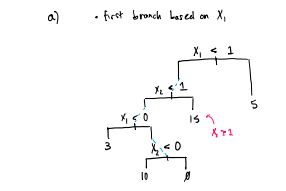
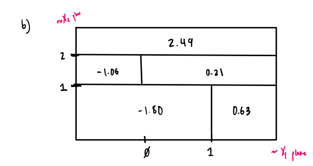

## ISL Exercise 8.4.3 (10pts)
Consider the Gini index, classification error, and entropy in a simple
classification setting with two classes. Create a single plot that displays each of these quantities as a function of $p̂_{m1}$ . 

* The x-axis should display $p̂_{m1}$ , ranging from 0 to 1, and the y-axis should display the value of the Gini index, classification error, and entropy.
* Hint: In a setting with two classes, $p̂_{m1}$ = 1 − $p̂_{m2}$ . You could make
this plot by hand, but it will be much easier to make in R.

$p̂_{m1}$ is the proportion of class 1 observations in the m-th region, and $p̂_{m2}$ is the proportion of class 2 observations in the m-th region. The formulas for the Gini index, classification error, and entropy are as follows:

Gini Index: $G = 1 - p̂_{m1}^2 - p̂_{m2}^2$  
Classification Error: $E = 1 - max(p̂_{m1}, p̂_{m2})$  
Entropy: $H = -p̂_{m1} log(p̂_{m1}) - p̂_{m2} log(p̂_{m2})$ 

* ~ define 0 log(0) = 0 (so we don't get undefined values)

```{r}
library(ggplot2)

# Create a object to store values of p̂_{m1} & p̂_{m2} (reciprocal)
p_m1 <- seq(0, 1, by = 0.01)
p_m2 <- 1 - p_m1

probabilities <- data.frame(p_m1, p_m2)

ggplot(probabilities, aes(x = p_m1)) +
  geom_line(aes(y = 1 - p_m1^2 - p_m2^2, color = "Gini Index")) +
  geom_line(aes(y = 1 - pmax(p_m1, p_m2), color = "Classification Error")) +
  geom_line(aes(y = -p_m1 * log(p_m1) - p_m2 * log(p_m2), color = "Entropy")) +
  labs(x = expression(hat(p)[m1]), y = "Value", title = "Gini Index, Classification Error, and Entropy") +
  scale_color_manual(values = c("blue", "red", "green")) +
  theme_minimal() +
  theme(legend.title = element_blank()) +
  scale_y_continuous(limits = c(0, 1))
```

## ISL Exercise 8.4.4 (10pts)

This question relates to the plots in Figure 8.14.


(a) Sketch the tree corresponding to the partition of the predictor
space illustrated in the left-hand panel of Figure 8.14. The num-
bers inside the boxes indicate the mean of Y within each region.



(b) Create a diagram similar to the left-hand panel of Figure 8.14,
using the tree illustrated in the right-hand panel of the same
figure. You should divide up the predictor space into the correct
regions, and indicate the mean for each region.



## ISL Exercise 8.4.5 (10pts)

Suppose we produce ten bootstrapped samples from a data set
containing red and green classes. We then apply a classification tree
to each bootstrapped sample and, for a specific value of X, produce
10 estimates of P (Class is Red|X):

&emsp; 0.1, 0.15, 0.2, 0.2, 0.55, 0.6, 0.6, 0.65, 0.7, and 0.75.

There are two common ways to combine these results together into a
single class prediction. One is the majority vote approach discussed in
this chapter. The second approach is to classify based on the average
probability. In this example, what is the final classification under each
of these two approaches?

"majority vote: the overall prediction is the most commonly occurring
majority class among B (# of bootstrapped training sets) predictions"

* we look at the 10 estimates of P (Class is Red|X) and classify as Red if the majority of these estimates are greater than 0.5, and classify as Green otherwise.
* in this case, we have 6 estimates greater than 0.5 (0.55, 0.6, 0.6, 0.65, 0.7, and 0.75) and 4 estimates less than or equal to 0.5 (0.1, 0.15, 0.2, and 0.2). Therefore, the majority vote approach would classify this observation as __Red__.

With the average probability approach, we calculate the average of the 10 estimates of P (Class is Red|X):

* Average probability = (0.1 + 0.15 + 0.2 + 0.2 + 0.55 + 0.6 + 0.6 + 0.65 + 0.7 + 0.75) / 10 = 4.5 / 10 = 0.45
* Since the average probability of P (Class is Red|X) is less than 0.5, the average probability approach would classify this observation as __Green__.


## ISL Lab 8.3. `Boston` data set (30pts)

Follow the machine learning workflow to train regression tree, random forest, and boosting methods for predicting `medv`. Evaluate out-of-sample performance on a test set.

```{r setup}
library(GGally)
library(gtsummary)
library(ranger) # https://cran.r-project.org/web/packages/ranger/index.html
library(tidyverse)
library(tidymodels)
library(ISLR2)

library(rpart.plot) # visualize the tree structure
library(vip)        # variable importance plot
```

```{r}
sessionInfo()
```

### Pre-processing

```{r}
data(Boston)
Boston <- as_tibble(Boston) %>%
  filter(!is.na(medv)) # remove rows with missing values in the response variable

glimpse(Boston)

# Brief Feature Engineering
# chas and rad as factor variables
Boston <- Boston %>%
  mutate(chas = as.factor(chas),
          rad = as.factor(rad))
```

### Initial Splitting

```{r}
set.seed(321)
Boston_split <- initial_split(Boston, prop = 0.5)
Boston_split

Boston_train <- training(Boston_split)
Boston_test <- testing(Boston_split)
dim(Boston_train)
dim(Boston_test)
```

### Recipe/Pipeline creation

```{r}
reg_tree_recipe <- 
  recipe(
    medv ~ ., 
    data = Boston_train
  ) %>%
  # step may not be necessary due to pre-processing, but we include it for completeness
  step_naomit(medv) %>%
  # zero-variance filter for numeric predictor variables
  step_zv(all_numeric_predictors()) # %>% 
  # estimate the means and standard deviations
  # prep(training = Hitters_other, retain = TRUE)

reg_tree_recipe
```

### Model specification

https://parsnip.tidymodels.org/reference/decision_tree.html

```{r}
regression_tree_spec <- decision_tree(
  mode = "regression", # regression tree for prediction task
  cost_complexity = tune(),
  tree_depth = tune(),
  min_n = 5,
  engine = "rpart"
)
# %>% set_engine("rpart", control = rpart.control(cp = 0.01, maxdepth = 5, minsplit = 10))
```

### Pipeline creation & Tuning Grid
```{r}
reg_tree_wf <- workflow() %>%
  add_recipe(reg_tree_recipe) %>%
  add_model(regression_tree_spec)
reg_tree_wf
```

"ccp_alpha is the Minimal Cost-Complexity Pruning parameter. Greater values of ccp_alpha increase the number of nodes pruned."
```{r}
tree_grid <- grid_regular(cost_complexity(),
                          tree_depth(),
                          levels = c(100, 5))
```

### Cross Validation & Visualization

```{r}
set.seed(321)
Boston_folds <- vfold_cv(Boston_train, v = 5)
Boston_folds
```

```{r}
reg_tree_fit <- reg_tree_wf %>%
  tune_grid(
    resamples = Boston_folds,
    grid = tree_grid,
    control = control_grid(save_pred = TRUE)
  )
reg_tree_fit
```

```{r}
# visualize tuning results

reg_tree_fit %>%
  collect_metrics() %>%
  print(width = Inf) %>%
  filter(.metric == "rmse") %>%
  mutate(tree_depth = as.factor(tree_depth)) %>%
  ggplot(mapping = aes(x = cost_complexity, y = mean, color = tree_depth)) +
  geom_point() + 
  geom_line() + 
  labs(x = "cost_complexity", y = "CV rmse")
```

We see that stump underfits, deeper trees do better, and too much pruning hurts performance.

### Identify the best model and evaluate on the test set

```{r}
reg_tree_fit %>%
  show_best(metric = "rmse")

best_reg_tree <- reg_tree_fit %>%
  select_best(metric = "rmse")
best_reg_tree
```

The best model has a tree depth of 8. (not at the min or max so it is not a boundary case)

```{r}
final_reg_tree_wf <- reg_tree_wf %>%
  finalize_workflow(best_reg_tree)
final_reg_tree_wf

# Fit the whole training set, then evaluate on the test set
final_reg_tree_fit <- final_reg_tree_wf %>%
  last_fit(Boston_split)

# compile metrics
final_reg_tree_fit %>%
  collect_metrics()
```

### Visuallize the final regression tree

```{r}
final_reg_tree <- extract_workflow(final_reg_tree_fit)

# shows the tree structure with the splits and the mean values in each terminal node
final_reg_tree %>%
  extract_fit_engine() %>%
  rpart.plot(roundint = FALSE)

# ~ variable importance plot (gini importance)
final_reg_tree %>%
  extract_fit_engine() %>%
  vip(num_features = 10)
```

## ISL Lab 8.3 `Carseats` data set (30pts)

Follow the machine learning workflow to train classification tree, random forest, and boosting methods for classifying `Sales <= 8` versus `Sales > 8`. Evaluate out-of-sample performance on a test set.

### Pre-processing

```{r}
# library(ISLR2)

data(Carseats)
Carseats <- as_tibble(Carseats) %>%
  filter(!is.na(Sales)) # remove rows with missing values in the response variable
glimpse(Carseats)
```

```{r}
# Documentation: https://rdrr.io/cran/ISLR2/man/Carseats.html

# create a new binary variable for classification ~ factor variable
# Urban and US alredy coded as factor variables
Carseats <- Carseats %>%
  mutate(
    Sales_Level = factor(if_else(Sales <= 8, "Low", "High"),
                         levels = c("Low", "High"))
  ) %>%
  select(-Sales)
```

### Initial Splitting

```{r}
set.seed(321)
Carseats_split <- initial_split(Carseats,
    prop = 0.5,
    strata = Sales_Level
    )
Carseats_split

Carseats_train <- training(Carseats_split)
Carseats_test <- testing(Carseats_split)

dim(Carseats_train)
dim(Carseats_test)
```

### Recipe/Pipeline creation

```{r}
class_tree_recipe <-
  recipe(
    Sales_Level ~ ., 
    data = Carseats_train
  ) %>%
  step_naomit(Sales_Level) %>%
  # zero-variance filter for numeric predictor variables
  step_zv(all_numeric_predictors()) # %>% 
  # estimate the means and standard deviations
  # prep(training = Hitters_other, retain = TRUE)
class_tree_recipe
```

### Model specification

```{r}
class_tree_spec <- decision_tree(
  mode = "classification", # classification tree for classification task
  cost_complexity = tune(),
  tree_depth = tune(),
  min_n = 5,
  engine = "rpart"
)
```

### Pipeline creation & Tuning Grid

```{r}
class_tree_wf <- workflow() %>%
  add_recipe(class_tree_recipe) %>%
  add_model(class_tree_spec)
class_tree_wf
```

```{r}
#| eval: false
# utilize the same grid; evaluation of this chunk set to false
tree_grid <- grid_regular(cost_complexity(),
                          tree_depth(),
                          levels = c(100, 5))
```

### Cross Validation & Visualization

```{r}
set.seed(321)

# ~ Incorporation of strata within the cross validation folds
Carseats_fold <- vfold_cv(Carseats_train, v = 5, strata = Sales_Level)
Carseats_fold
```

```{r}
class_tree_fit <- class_tree_wf %>%
  tune_grid(
    resamples = Carseats_fold,
    grid = tree_grid,
    metrics = metric_set(accuracy, roc_auc)
  )
class_tree_fit
```

```{r}
class_tree_fit %>%
  collect_metrics() %>%
  print(width = Inf) %>%
  filter(.metric == "roc_auc") %>%
  mutate(tree_depth = as.factor(tree_depth)) %>%
  ggplot(mapping = aes(x = cost_complexity, y = mean, color = tree_depth)) +
  geom_point() + 
  geom_line() + 
  labs(x = "cost_complexity", y = "CV roc_auc")
```

The red line (tree_depth = 1) sits around 0.56 AUC, which is only slightly better than random guessing (0.50) showing that the stump underfits. moderate depth + moderate pruning → best AUC and heavier pruning hurts performance.

### Identify the best model and evaluate on the test set

~ Evaluate out-of-sample performance on a test set.

```{r}
class_tree_fit %>%
  show_best(metric = "accuracy")
best_class_tree <- class_tree_fit %>%
  select_best(metric = "accuracy")
best_class_tree
```

The best model has a tree depth of 8. (not at the min or max so it is not a boundary case)


```{r}
final_class_tree_wf <- class_tree_wf %>%
  finalize_workflow(best_class_tree)
final_class_tree_wf

final_class_tree_fit <- final_class_tree_wf %>%
  last_fit(Carseats_split)

final_class_tree_fit %>%
  collect_metrics()
```

### Visuallize the final classification tree

```{r}
final_class_tree <- extract_workflow(final_class_tree_fit)

# shows the tree structure with the splits and the mean values in each terminal node
final_class_tree %>%
  extract_fit_engine() %>%
  rpart.plot(roundint = FALSE)

# ~ variable importance plot (gini importance)
final_class_tree %>%
  extract_fit_engine() %>%
  vip(num_features = 10)
```