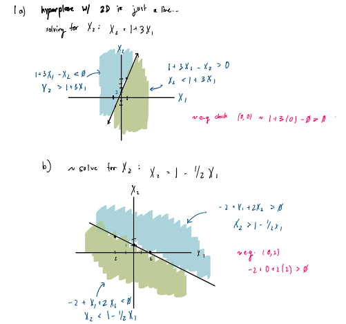
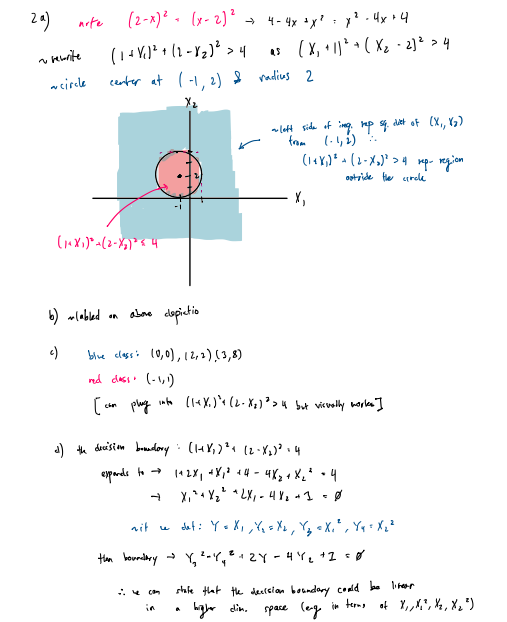
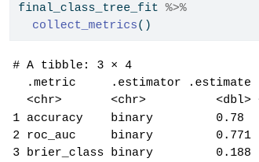

## ISL Exercise 9.7.1 (10pts)




## ISL Exercise 9.7.2 (10pts)





## Support vector machines (SVMs) on the `Carseats` data set (30pts)

Follow the machine learning workflow to train support vector classifier (same as SVM with linear kernel), SVM with polynomial kernel (tune the degree and regularization parameter $C$), and SVM with radial kernel (tune the scale parameter $\gamma$ and regularization parameter $C$) for classifying `Sales<=8` versus `Sales>8`. Use the same seed as in your HW4 for the initial test/train split and compare the final test AUC and accuracy to those methods you tried in HW4.

### Libraries/Preprocessing

```{r}
library(ISLR2)

library(GGally)
library(gtsummary)
library(kernlab) # for SVM
library(tidyverse)
library(tidymodels)
```

```{r}
Carseats <- Carseats %>%
  mutate(
    Sales_Level = factor(if_else(Sales <= 8, "Low", "High"),
                         levels = c("Low", "High"))
  ) %>%
  select(-Sales) # %>%
  # print(Width = Inf)
```

print out a brief summary 
```{r}
Carseats %>% tbl_summary(by = Sales_Level)
```

```{r}
# same seed as in HW4
set.seed(321)

Carseats_split <- initial_split(
  Carseats, 
  # stratify by Sales_Level
  strata = "Sales_Level", 
  prop = 0.75
  )

Carseats_split

# verify dim
Carseats_train <- training(Carseats_split)
Carseats_test <- testing(Carseats_split)

dim(Carseats_train)
dim(Carseats_test)
```

### Specify the recipe

```{r}
# modification of recipe from workflow

svm_recipe <- 
  recipe(
    Sales_Level ~ ., 
    data = Carseats
  ) %>%
  # mean imputation for Numeric predictors
  step_impute_mean(all_numeric_predictors()) %>%
  # mode imputation for categorical predictors
  step_impute_mode(all_nominal_predictors()) %>%
  # create traditional dummy variables (necessary for svm)
  step_dummy(all_nominal_predictors()) %>%
  # zero-variance filter
  step_zv(all_numeric_predictors()) %>% 
  # center and scale numeric data
  step_normalize(all_predictors())
  # step_novel(all_nominal_predictors())

svm_recipe
```

### Model Specification

```{r}
# linear SVM
svm_linear_mod <- 
  svm_linear(
    mode = "classification",
    cost = tune()
  ) %>%
  set_engine("kernlab")

# polynomial SVM
svm_poly_mod <- 
  svm_poly(
    mode = "classification",
    cost = tune(),
    degree = tune()
  ) %>%
  set_engine("kernlab")

# radial SVM
svm_rbf_mod <- 
  svm_rbf(
    mode = "classification",
    cost = tune(),
    rbf_sigma = tune()
    # degree = 1
  ) %>%
  set_engine("kernlab")
```

### Tuning Grid Specification

```{r}
# Linear SVM
linear_grid <- grid_regular(
  cost(range = c(-3, 2)),
  levels = 5
)

# Polynomial SVM
poly_grid <- grid_regular(
  cost(range = c(-3, 2)),
  degree(range = c(1, 5)),
  levels = c(5, 5)
)

# Radial SVM
rbf_grid <- grid_regular(
  cost(range = c(-3, 2)),
  rbf_sigma(range = c(-3, 1)),
  levels = c(5, 5)
)
```

### Build Workflows

```{r}
svm_linear_wf <- workflow() %>%
  add_model(svm_linear_mod) %>%
  add_recipe(svm_recipe)

svm_poly_wf <- workflow() %>%
  add_model(svm_poly_mod) %>%
  add_recipe(svm_recipe)

svm_rbf_wf <- workflow() %>%
  add_model(svm_rbf_mod) %>%
  add_recipe(svm_recipe)
```

### Cross-validation and Tuning

```{r}
set.seed(321)
cv <- vfold_cv(Carseats_train, v = 5)
```

### Linear SVM Cross Validation + Finalization
```{r}
#| cahche = TRUE
svm_linear_fit <- svm_linear_wf %>%
  tune_grid(
    resamples = cv,
    grid = linear_grid,
    metrics = metric_set(roc_auc, accuracy)
  )
```

Visualizing the tuning results
```{r}
svm_linear_fit %>%
  collect_metrics() %>%
  filter(.metric == "roc_auc") %>%
  ggplot(aes(x = cost, y = mean)) +
  geom_point() +
  geom_line() +
  labs(x = "Cost", y = "CV AUC") +
  scale_x_log10()
```

```{r}
svm_linear_fit %>%
  show_best(metric = "roc_auc")

best_linear <- svm_linear_fit %>%
  select_best(metric = "roc_auc")
```

Finalizing workflow with the best hyperparameters
```{r}
final_linear_wf <- svm_linear_wf %>%
  finalize_workflow(best_linear)

final_linear_wf
```

Predct on the test set and evaluate
```{r}
final_linear_fit <- 
  final_linear_wf %>%
  last_fit(Carseats_split)

final_linear_fit %>%
  collect_metrics()
```

### Polynomial SVM Cross Validation + Finalization

```{r}
#| cache = TRUE
svm_poly_fit <- svm_poly_wf %>%
  tune_grid(
    resamples = cv,
    grid = poly_grid,
    metrics = metric_set(roc_auc, accuracy)
  )
```
Visualize tuning results
```{r}
svm_poly_fit %>%
  collect_metrics() %>%
  filter(.metric == "roc_auc") %>%
  ggplot(aes(x = cost, y = mean, color = factor(degree))) +
  geom_point() +
  geom_line() +
  labs(x = "Cost", y = "CV AUC", color = "Degree") +
  scale_x_log10()
```

```{r}
svm_poly_fit %>%
  show_best(metric = "roc_auc")

best_poly <- svm_poly_fit %>%
  select_best(metric = "roc_auc")
```

Finalize wf
```{r}
final_poly_wf <- svm_poly_wf %>%
  finalize_workflow(best_poly)

final_poly_wf
```
Predict on test set and evaluate
```{r}
final_poly_fit <- final_poly_wf %>%
  last_fit(Carseats_split)

final_poly_fit %>%
  collect_metrics()
```

### Radial SVM Cross Validation + Finalization

```{r}
#| cache = TRUE
svm_rbf_fit <- svm_rbf_wf %>%
  tune_grid(
    resamples = cv,
    grid = rbf_grid,
    metrics = metric_set(roc_auc, accuracy)
  )
```

Visualize tuning results
```{r}
#| cache = TRUE
svm_rbf_fit <- svm_rbf_wf %>%
  tune_grid(
    resamples = cv,
    grid = rbf_grid,
    metrics = metric_set(roc_auc, accuracy)
  )
```
```{r}
svm_rbf_fit %>%
  show_best(metric = "roc_auc")

best_rbf <- svm_rbf_fit %>%
  select_best(metric = "roc_auc")
```

Finalize wf
```{r}
final_rbf_wf <- svm_rbf_wf %>%
  finalize_workflow(best_rbf)

final_rbf_wf
```

```{r}
final_rbf_fit <- final_rbf_wf %>%
  last_fit(Carseats_split)

final_rbf_fit %>%
  collect_metrics()
```

### Overall Table

```{r}
linear_results <- final_linear_fit %>%
  collect_metrics() %>%
  mutate(Model = "Linear SVM")

poly_results <- final_poly_fit %>%
  collect_metrics() %>%
  mutate(Model = "Polynomial SVM")

rbf_results <- final_rbf_fit %>%
  collect_metrics() %>%
  mutate(Model = "Radial SVM")

svm_results <- bind_rows(linear_results, poly_results, rbf_results) %>%
  select(Model, .metric, .estimate)  %>%
  pivot_wider(
    names_from = .metric,
    values_from = .estimate
  )

svm_results
```

Referencing the performance of the tree-based classification:



Across the the metrics of accuracy, CV ROC AUC, and brier classification score (lower value is better), SVM methods perform similarly to one another (Radial SVM being slightly worse for this task) and all outperform the tree-based classification method.

## Bonus (10pts)

Let
$$
f(X) = \beta_0 + \beta_1 X_1 + \cdots + \beta_p X_p = \beta_0 + \beta^T X. 
$$
Then $f(X)=0$ defines a hyperplane in $\mathbb{R}^p$. Show that $f(x)$ is proportional to the signed distance of a point $x$ to the hyperplane $f(X) = 0$. 
